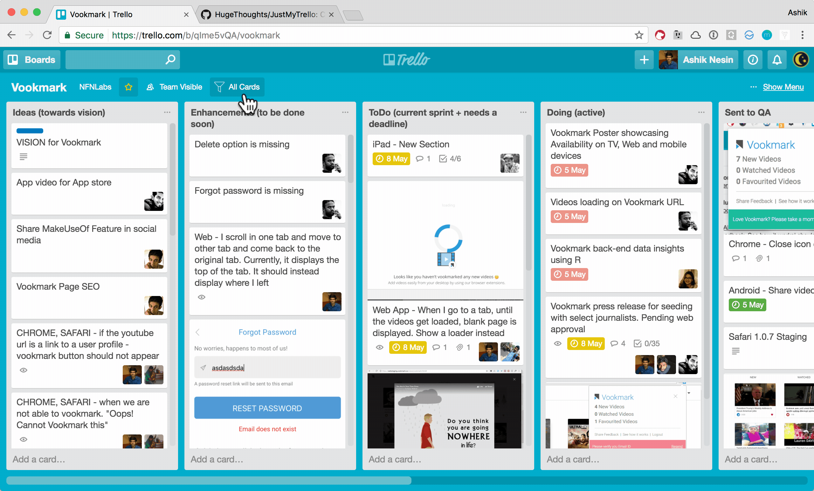

# JustMyTrello - View Your Cards
> Just view the cards that are assigned to you on Trello board

## Install
Install it from the [Chrome Web Store](https://chrome.google.com/webstore/detail/justmytrello-view-your-ca/nnljokkhckpgfhfkhhkmiecmdgcafkba)

## License
MIT © [Ashik Nesin](http://ashiknesin.com)
